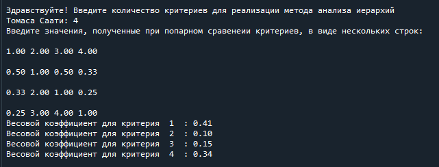

# Метод анализа иерархий Томаса Саати

Назначение программы
-----
Программа предназначена для нахождения весовых коэффициентов критерийев первого уровня, используя метод анализа иерархий Томаса Саати.

 Запуск программы
 -----
 Программу следует запускать в среде, поддерживающей язык программирования Python. После запуска необходимо ввести количество коэффициентов и результат их попарного сравнения.

 Выполнение программы
 -----
 
